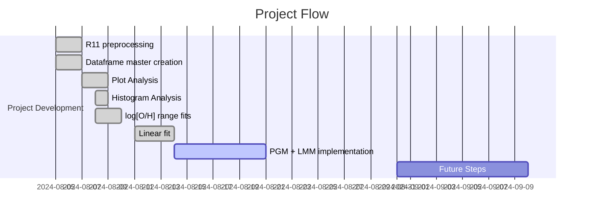

# Project Log and Updates

## Table of Contents
1. [Project Overview](#project-overview)
2. [Project Flow](#project-flow)
3. [Current Stage and Results](#current-stage-and-results)
4. [Next Steps](#next-steps)
5. [Future Ideas](#future-ideas)
6. [Bibliographic References](#bibliographic-references)

---

## Project Overview
This project aims to explore the universality of the Period-Luminosity 
$(P−L)$ relationship across different galaxies using hierarchical models. By employing the Monte Carlo Markov Chain (MCMC) method with the Metropolis-Hastings (MH) algorithm, we analyze the $(P-L)$ relationship parameters in various galactic environments. The goal is to determine whether these parameters remain consistent and potentially universal, thus providing insights into the broader applicability of the $(P−L)$ relationship in cosmic distance measurements.

## Project Flow
Here you can check a chronological flow of everything that was done in the project.

### Timeline

### Detailed Flow

| Date | Task | Progress | Notebook |
| --- | --- | --- | --- |
| 2024-08-05 | Preprocessing of data from Riess et al. 2011: `R11` dataset | Done! | [Cepheids Data](https://github.com/GabrielWendell/Cepheids_Projects/blob/main/Project_1/Cepheids_Data.ipynb) |
| 2024-08-05 | Master dataframe preparation: calculation of `d_L`, `M`, `Merr` and `logP` | Done! | [Cepheids Data](https://github.com/GabrielWendell/Cepheids_Projects/blob/main/Project_1/Cepheids_Data.ipynb) |
| 2024-08-06 | Visual analysis of dataframe information: $\log_{10}\text{P}\times M$, $\log_{10}\left[\text{O/H}\right]\times M$ (NGC Number) | Done! | [Cepheids Data](https://github.com/GabrielWendell/Cepheids_Projects/blob/main/Project_1/Cepheids_Data.ipynb) |	
| 2024-08-06 | Analysis of histograms of rotation period frequencies and metallicity by galaxy | Done! | [Cepheids Data](https://github.com/GabrielWendell/Cepheids_Projects/blob/main/Project_1/Cepheids_Data.ipynb) |
| 2024-08-08 | Linear fit for metallicity for different metallicity ranges (Leonardo's idea) | Done! | [Cepheids Data](https://github.com/GabrielWendell/Cepheids_Projects/blob/main/Project_1/Cepheids_Data.ipynb) |
| 2024-08-14 | Linear Fit for the Period of the entire dataset. | Done! | [Cepheids Data](https://github.com/GabrielWendell/Cepheids_Projects/blob/main/Project_1/Cepheids_Data.ipynb) |
| 2024-08-21 | Construction of a PGM model to fit the $(P-L)$ relation for a specific galaxy. | Loading... | [One Galaxy](https://github.com/GabrielWendell/Cepheids_Projects/blob/main/Project_1/Cepheids_One_Galaxy.ipynb) |

## Current Stage and Results
As of the latest update, the project is in the **development phase of PGM and LMM to obtain the $(P-L)$ relation for a specific galaxy**. The latest results are as follows:
- **Key Findings :** `Scipy` linear fit is not very good but it serves as a good start!
- **Performance Metrics :** $a=-7.2781\pm 0.0323\quad,\quad b = -3.1175 \pm 0.1174$
- **Last results obtained :**

  
  

## Next Steps
The upcoming steps in the project include:
1. Development of PGM and LLM for a specific galaxy ;
2. Run `emcee` for the linear model of the relationship $(P-L)$ ;
3. Repeat the procedure for multiple galaxies.

## Future Ideas
Here are some potential ideas to explore in the future:
- **Idea 1:** Use other samplers within MCMC such as HMC.
- **Idea 2:** Check if the `R11` dataset has received updates.

---

## Bibliographic References
> - Riess paper: [Riess et al. 2011, *The Astrophysical Journal*, **730**(2), p.119.](https://iopscience.iop.org/article/10.1088/0004-637X/730/2/119/meta)
> - PGM Book: [Koller, D. and Friedman, N., 2009. *Probabilistic graphical models: principles and techniques*. MIT press.](http://mcb111.org/w06/KollerFriedman.pdf)
> - `emcee` paper: [Foreman-Mackey, et al., 2013, *Publications of the Astronomical Society of the Pacific*, **125**(925), p.306.](https://iopscience.iop.org/article/10.1086/670067/meta)
