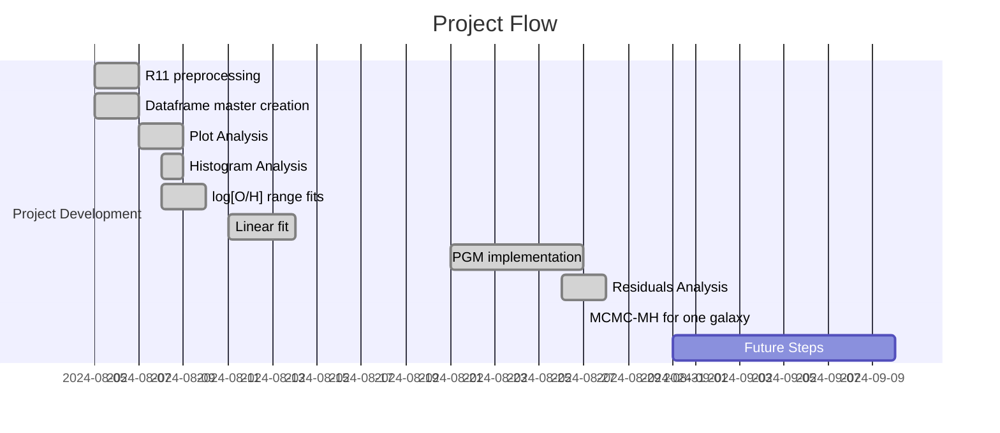
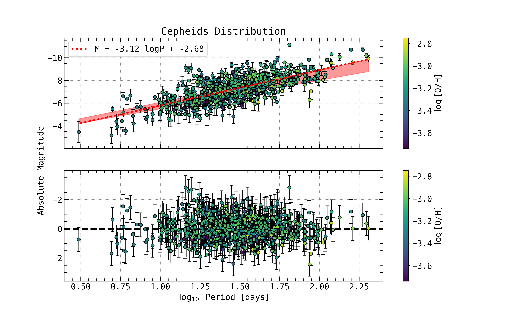
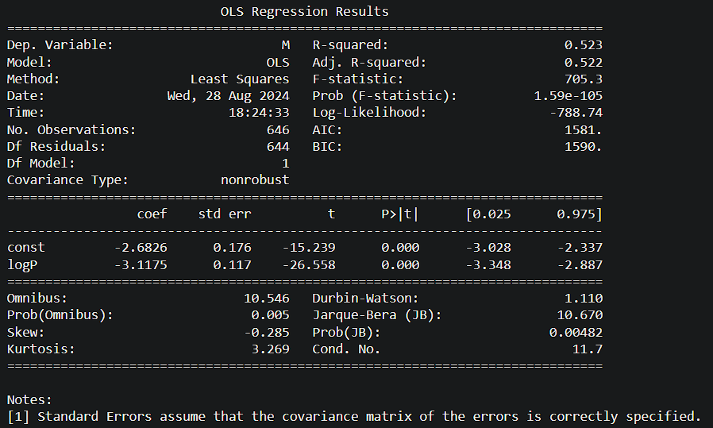

# Project Log and Updates

## Table of Contents

1. [Project Overview](#project-overview)
2. [Project Flow](#project-flow)
3. [Current Stage and Results](#current-stage-and-results)
4. [Next Steps](#next-steps)
5. [Future Ideas](#future-ideas)
6. [Bibliographic References](#bibliographic-references)
7. [General Comments](#general-comments)

---

## Project Overview

This project aims to explore the universality of the Period-Luminosity $(P−L)$ relationship across different galaxies using hierarchical models. By employing the Monte Carlo Markov Chain (MCMC) method with the Metropolis-Hastings (MH) algorithm, we analyze the $(P-L)$ relationship parameters in various galactic environments. The goal is to determine whether these parameters remain consistent and potentially universal, thus providing insights into the broader applicability of the $(P−L)$ relationship in cosmic distance measurements.

## Project Flow

Here you can check a chronological flow of everything that was done in the project.

### Timeline

### Detailed Flow

| Date       | Task                                                                                                                           | Progress   | Notebook                                                                                                        |
| ---------- | ------------------------------------------------------------------------------------------------------------------------------ | ---------- | --------------------------------------------------------------------------------------------------------------- |
| 2024-08-05 | Preprocessing of data from Riess et al. 2011: `R11` dataset                                                                    | Done!      | [Cepheids Data](https://github.com/GabrielWendell/Cepheids_Projects/blob/main/Project_1/Notebooks/Cepheids_Data.ipynb)    |
| 2024-08-05 | Master dataframe preparation: calculation of `d_L`, `M`, `Merr` and `logP`                                                     | Done!      | [Cepheids Data](https://github.com/GabrielWendell/Cepheids_Projects/blob/main/Project_1/Notebooks/Cepheids_Data.ipynb)    |
| 2024-08-06 | Visual analysis of dataframe information: $\log_{10}\text{P}\times M$, $\log_{10}\left[\text{O/H}\right]\times M$ (NGC Number) | Done!      | [Cepheids Data](https://github.com/GabrielWendell/Cepheids_Projects/blob/main/Project_1/Notebooks/Cepheids_Data.ipynb)    |
| 2024-08-06 | Analysis of histograms of rotation period frequencies and metallicity by galaxy                                                | Done!      | [Cepheids Data](https://github.com/GabrielWendell/Cepheids_Projects/blob/main/Project_1/Notebooks/Cepheids_Data.ipynb)    |
| 2024-08-08 | Linear fit for metallicity for different metallicity ranges (Leonardo's idea)                                                  | Done!      | [Cepheids Data](https://github.com/GabrielWendell/Cepheids_Projects/blob/main/Project_1/Notebooks/Cepheids_Data.ipynb)    |
| 2024-08-14 | Linear Fit for the Period of the entire dataset.                                                                               | Done!      | [Cepheids Data](https://github.com/GabrielWendell/Cepheids_Projects/blob/main/Project_1/Notebooks/Cepheids_Data.ipynb)    |
| 2024-08-27 | Construction of a PGM model to fit the $(P-L)$ relation for a specific galaxy.                                                 | Done       | [One Galaxy](https://github.com/GabrielWendell/Cepheids_Projects/blob/main/Project_1/Notebooks/Cepheids_One_Galaxy.ipynb) |
| 2024-08-27 | Obtaining the posterior distribution from MCMC-MH for the model $M_{ij}=M_{1}+a\cdot\log_{10}P_{ij}+b+\varepsilon_{ij}$        | Done!      | [One Galaxy](https://github.com/GabrielWendell/Cepheids_Projects/blob/main/Project_1/Notebooks/Cepheids_One_Galaxy.ipynb) |
| 2024-08-28 | Linear fit using OLS (Ordinary Linear Regression) and subtraction of the fit from the data to obtain the residuals.            | Done!      | [Metallicity Analysis](https://github.com/GabrielWendell/Cepheids_Projects/blob/main/Project_3/Notebooks/Metallicity_Analysis.ipynb)|
| 2024-09-02 | João takes the lead on the project. Adjusting the $(P-L)$ relationship using `emcee` to the data.                              | Loading... | [One Galaxy](https://github.com/GabrielWendell/Cepheids_Projects/blob/main/Project_1/Notebooks/Cepheids_One_Galaxy.ipynb) |

## Current Stage and Results

As of the latest update, the project is in the **use the `emcee` library for a linear fit to the data**. The latest results are as follows:

- **Key Findings :** The residue presents a high dispersion..

- **Performance Metrics :** Fit  
  
  > $a=-3.11748848959179\pm 0.11738523313974678$ \
  > $b=-2.6825523078758415\pm 0.1760344604089304$

- **Last results obtained :**

  
  

## Next Steps

The upcoming steps in the project include:

1. Testing Multiple Regression models ;

2. Run `emcee` for the linear model of the relationship $(P-L)$ ;

3. Run `emcee` for the linear model of the relationship $(P-L)$ with different samplers;

4. Repeat the procedure for multiple galaxies.

## Future Ideas

Here are some potential ideas to explore in the future:

- **Idea 1:** Use other samplers within MCMC such as HMC.
- **Idea 2:** Check if the `R11` dataset has received updates.

## Bibliographic References

> - Riess paper: [Riess et al. 2011, *The Astrophysical Journal*, **730**(2), p.119.](https://iopscience.iop.org/article/10.1088/0004-637X/730/2/119/meta)
> - PGM Book: [Koller, D. and Friedman, N., 2009. *Probabilistic graphical models: principles and techniques*. MIT press.](http://mcb111.org/w06/KollerFriedman.pdf)
> - `emcee` paper: [Foreman-Mackey, et al., 2013, *Publications of the Astronomical Society of the Pacific*, **125**(925), p.306.](https://iopscience.iop.org/article/10.1086/670067/meta)

## General Comments

This section is dedicated to general discussions and comments among the project collaborators. Please include your name, the date, and your comment below.

### Comments:

**Name**: Wendell  
**Date**: 2024-08-27  

> I implemented a linear fit on the data using PGM. Although it improved compared to the fit using Scipy, it was not very significant... \
> I did the first tests using `emcee`. The results do not seem good to me, maybe I did or defined something wrong... I need to check it out calmly because this is my first time really using `emcee`.

> What do you think?

---

**Name**: Wendell \
**Date**: 2024-09-02

> Include João in the project. The reason for including him was because he has more experience using the `emcee` library than I do, since he works with it daily. \
> His name has already been included in the READMEs, Notebooks and License.

---
