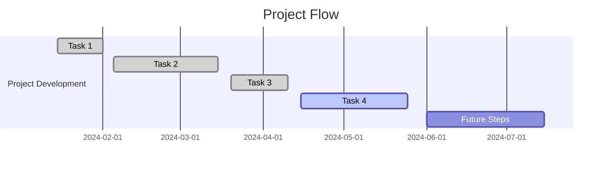

# Project Log and Updates

## Table of Contents
1. [Project Overview](#project-overview)
2. [Project Flow](#project-flow)
3. [Current Stage and Results](#current-stage-and-results)
4. [Next Steps](#next-steps)
5. [Future Ideas](#future-ideas)
6. [Bibliographic References](#bibliographic-references)

---

## Project Overview
This project aims to explore the universality of the Period-Luminosity 
$(P−L)$ relationship across different galaxies using hierarchical models. By employing the Monte Carlo Markov Chain (MCMC) method with the Metropolis-Hastings (MH) algorithm, we analyze the $(P-L)$ relationship parameters in various galactic environments. The goal is to determine whether these parameters remain consistent and potentially universal, thus providing insights into the broader applicability of the $(P−L)$ relationship in cosmic distance measurements.

## Project Flow
This section provides a chronological flow of everything accomplished in the project.

### Timeline

### Detailed Flow

| Date | Task/Progress | Result |
| --- | --- | --- |
| 2024-01-15 |	Initial project setup and data collection. | Result 1 |
| 2024-02-05 |	Data preprocessing and cleaning. | Result 2 |
| 2024-03-20 |	Preliminary analysis and modeling. | Result 3 |	
| 2024-04-15 |	Model optimization and validation. | Result 4 |

## Current Stage and Results
As of the latest update, the project is in the [describe the current phase, e.g., model refinement, results analysis, etc.]. The latest results are as follows:
- **Key Findings:** [brief summary of the results]
- **Performance Metrics:** [e.g., accuracy, precision, etc.]
- **Representative Image:**

## Next Steps
The upcoming steps in the project include:
1. [Next task or milestone]
2. [Further analysis or model adjustment]
3. [Implementation of additional features or tests]

## Future Ideas
Here are some potential ideas to explore in the future:
- **Idea 1:** [description of the idea and its relevance to the project]
- **Idea 2:** [description of the idea and its relevance to the project]
- **Idea 3:** [description of the idea and its relevance to the project]

---

## Bibliographic References
> - [Ref. 1]()
> - [Ref. 2]()
> - [Ref. 3]()
