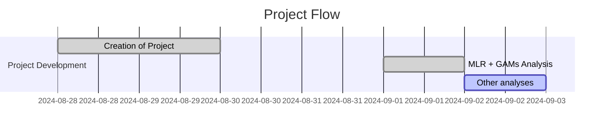

# Project Log and Updates

## Table of Contents

1. [Project Overview](#project-overview)
2. [Project Flow](#project-flow)
3. [Current Stage and Results](#current-stage-and-results)
4. [Next Steps](#next-steps)
5. [Future Ideas](#future-ideas)
6. [Bibliographic References](#bibliographic-references)
7. [General Comments](#general-comments)

---

## Project Overview

This project aims to explore the the influence of metallicity $\log{\left[\text{O/H}\right]}$ on the Period-Luminosity $(P-L)$ relationship of Cepheids using a variety of statistical and ML methods, including Multiple Linear Regressions and Generalized Additive Models (GAMs).

## Project Flow

Here you can check a chronological flow of everything that was done in the project.

### Timeline

### Detailed Flow

| Date       | Task                                                                                                                           | Progress   | Notebook                                                                                                        |
| ---------- | ------------------------------------------------------------------------------------------------------------------------------ | ---------- | --------------------------------------------------------------------------------------------------------------- |
| 2024-08-30 | Creation of the Metallicity_Analysis.ipynb Notebook and first sketches                                                         | Done!      | [Metallicity Analysis](https://github.com/GabrielWendell/Cepheids_Projects/blob/main/Project_3/Notebooks/Metallicity_Analysis.ipynb) |
| 2024-09-02 | Analysis of the influence of $\log{\left[\text{O/H}\right]}$ using MLR and Linear GAMs.                                        | Done!      | [Metallicity Analysis](https://github.com/GabrielWendell/Cepheids_Projects/blob/main/Project_3/Notebooks/Metallicity_Analysis.ipynb) |
| 2024-09-03 | Implementation of ML methods such as XGBoost for detecting non-linear effects.                                                 | Loading... | [ML Analysis](https://github.com/GabrielWendell/Cepheids_Projects/blob/main/Project_3/Notebooks/ML_Analysis.ipynb) |

## Current Stage and Results

As of the latest update, the project is at the stage of **using ML methods to capture nonlinearities in the $(P-L)$ relationship**. The latest results are as follows:

- **Key Findings :** The influence of metallicity is highly nonlinear.

- **Performance Metrics :** LinearGAM Summary 
  

  

- **Last results obtained :**

  
  

## Next Steps

The upcoming steps in the project include:

- Test the following ML models:
> 1. Ridge and Lasso: include regularization terms to avoid overfitting;
> 2. Random Forest: try to capture non-linearities in metallicity;
> 3. SVR: using non-linear kernels;
> 4. NN: try initially with something like MLP;
> 5. GBM/XBoost: difficulty in data interpretability;
> 6. PCR: combine with PCA before regression.

- Conduct a literature review of related works.

## Future Ideas

Here are some potential ideas to explore in the future:

- **Idea 1:** Try to combine ML methods with other statistical methods to increase the robustness of the work.

## Bibliographic References

> - Trentin paper: [Trentin, E. et al., 2024. Cepheid Metallicity in the Leavitt Law (C-MetaLL) survey-IV. The metallicity dependence of Cepheid period–luminosity relations. *Astronomy & Astrophysics*, **681**, p.A65.](https://www.aanda.org/articles/aa/full_html/2024/01/aa47195-23/aa47195-23.html)

## General Comments

This section is dedicated to general discussions and comments among the project collaborators. Please include your name, the date, and your comment below.

### Comments:

**Name**: Wendell  
**Date**: 2024-00-03  

> I decided to create a new project focused only on the analysis of the influence of metallicity on the $(P-L)$ relationship. \
> Initially, I will try to obtain an approximate equation that relates the quantities $M$, $\log{(P)}$ and $\log{\left[\text{OH}\right]}$. \
> Since the MLR and GAM models were not working, I will try an approach using ML from now on.

> What do you think?

---
